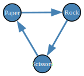

# Math::GameTheory

The package provides descriptions and data of different games amenable for Game Theory experiments and studies.

----

## Installation

From [Zef ecosystem](https://raku.land):

```
zef install Math::GameTheory
```

From GitHub:

```
zef install https://github.com/antononcube/Raku-Math-GameTheory
```

----

## Game Theory data

All games known by the package "Math::GameTheory":

```raku
use Math::GameTheory;

say "Total number of known games: {game-theory-data().elems}";
say game-theory-data();
```
```
# Total number of known games: 52
# (3Coordination ArmsRaces BachOrStravinsky BattleOfTheBismarck BattleOfTheSexes BeerQuiche BertrandOligopoly BuyingStock Centipede Chicken ColonelBlotto Compound Contribution Convergence CournotOligopoly DangerousCoordination DinersDilemma Discoordination ElFarolBar Entry Escalation Exponential Greedy GuessTwoThirdsAverage HawkDove Hero Inspection LinearCournotDuopoly LinearCournotOligopoly MatchingPennies Morra MultivariateRandom NashPoker OPD OddsAndEvens OptionalPrisonersDilemma PlatoniaDilemma PrisonersDilemma PureCoordination Random Revolution RockPaperScissors Shapley SimpleInspection SmallPig StagHunt TravelersDilemma TreeBattleOfTheBismarck TreeMatchingPennies VolunteersDilemma Welfare ZeroSumRandom)
```

Games and their classes:

```raku
my @dsGames = game-theory-data(Whatever, property => "Classes").map({ $_.key X $_.value.Array }).flat(1).map({ <name property> Z=> $_  })».Hash;
@dsGames.elems
```
```
# 153
```

Here is a summary:

```raku
use Data::Summarizers;

sink records-summary(@dsGames)
```
```
# +------------------+--------------------------+
# | property         | name                     |
# +------------------+--------------------------+
# | MatrixGame => 42 | VolunteersDilemma => 5   |
# | 2Player    => 26 | RockPaperScissors => 5   |
# | Symmetric  => 24 | MatchingPennies   => 5   |
# | NPlayer    => 12 | ZeroSumRandom     => 5   |
# | Social     => 10 | PureCoordination  => 5   |
# | TreeGame   => 7  | Shapley           => 4   |
# | Recreation => 6  | Welfare           => 4   |
# | (Other)    => 26 | (Other)           => 120 |
# +------------------+--------------------------+
```

Here is a "taxonomy tree" like breakdown:

```raku
use ML::TriesWithFrequencies;

my %cat = <2Player 3Player NPlayer MatrixGame TreeGame Symmetric> Z=> (^7);

game-theory-data(Whatever, property => "Classes").values
==> { .map({ %cat.keys (&) $_ }) }()
==> { $_.map({ $_ ?? $_.keys !! 'Other' })».sort({ %cat{$_} })».List }()
==> trie-create()
==> trie-form()
```
```
# TRIEROOT => 52
# ├─2Player => 26
# │ ├─MatrixGame => 25
# │ │ └─Symmetric => 14
# │ └─NPlayer => 1
# │   └─MatrixGame => 1
# ├─3Player => 3
# │ └─MatrixGame => 3
# ├─MatrixGame => 2
# ├─NPlayer => 11
# │ └─MatrixGame => 11
# │   └─Symmetric => 8
# ├─Other => 1
# ├─Symmetric => 2
# └─TreeGame => 7
```

----

## Two player games

Get the game "Chicken" (provided by the package):

```raku
my $obj = game-theory-data('Chicken')
```
```
# MatrixGame(:name("Chicken"), :number-of-players(2), :number-of-actions(("Player 1" => 2, "Player 2" => 2)))
```

Here is a description of the game:

```raku
$obj.description
```
```
# The name \"chicken\" has its origins in a dangerous game in which two drivers drive toward each other. Each driver has the choice to either continue or swerve. Either at least one driver swerves, or both may die in the crash. The driver who swerved will be called a chicken, meaning a coward.
```

Here is game's table:

```raku, results=asis
$obj.html
```
<table border="1" cellspacing="0" cellpadding="6">
  <caption align=bottom><i>Chicken</i></caption>  <tr>
    <th bgcolor="#f9cf92" style="color:#666666;"></th>
    <th bgcolor="#f9cf92" colspan="2" align="center" style="color:#666666;">Swerve</th>
    <th bgcolor="#f9cf92" colspan="2" align="center" style="color:#666666;">Straight</th>
  </tr>
  <tr>
    <th bgcolor="#9ecce6" align="left" style="color:#666666;">Swerve</th>
    <td bgcolor="#9ecce6" align="right" style="color:#666666;">0</td>
    <td bgcolor="#f9cf92" align="right" style="color:#666666;">0</td>
    <td bgcolor="#9ecce6" align="right" style="color:#666666;">-1</td>
    <td bgcolor="#f9cf92" align="right" style="color:#666666;">1</td>
  </tr>
  <tr>
    <th bgcolor="#9ecce6" align="left" style="color:#666666;">Straight</th>
    <td bgcolor="#9ecce6" align="right" style="color:#666666;">1</td>
    <td bgcolor="#f9cf92" align="right" style="color:#666666;">-1</td>
    <td bgcolor="#9ecce6" align="right" style="color:#666666;">-5</td>
    <td bgcolor="#f9cf92" align="right" style="color:#666666;">-5</td>
  </tr>
</table>


Here is a gray-scale version of the dataset can be obtained with `$obj.html(theme => 'gray-scale')`.


----

## Three player games

Get the game "3Coordination" (provided by the package):

```raku
my $obj = game-theory-data('3Coordination')
```
```
# MatrixGame(:name("3Coordination"), :number-of-players(3), :number-of-actions((:Roosevelt(3), :Churchill(3), :Stalin(3))))
```

```raku
$obj.description
```
```
# An extension of the coordination game where payoffs are based on the number of coordinated players.
```

Here is game's table:

```raku, results=asis
$obj.html
```
<table border="1" cellspacing="0" cellpadding="6">
  <caption align=bottom><i>3Coordination</i></caption>  <tr>
    <th bgcolor="#b7d7a8" style="color:#666666;"></th>
    <th bgcolor="#b7d7a8" colspan="9" align="center" style="color:#666666;">Churchill</th>
    <th bgcolor="#b7d7a8" colspan="9" align="center" style="color:#666666;">Roosevelt</th>
    <th bgcolor="#b7d7a8" colspan="9" align="center" style="color:#666666;">Stalin</th>
  </tr>
  <tr>
    <th bgcolor="#b7d7a8" style="color:#666666;"></th>
    <th bgcolor="#f9cf92" colspan="3" align="center" style="color:#666666;">Churchill</th>
    <th bgcolor="#f9cf92" colspan="3" align="center" style="color:#666666;">Roosevelt</th>
    <th bgcolor="#f9cf92" colspan="3" align="center" style="color:#666666;">Stalin</th>
    <th bgcolor="#f9cf92" colspan="3" align="center" style="color:#666666;">Churchill</th>
    <th bgcolor="#f9cf92" colspan="3" align="center" style="color:#666666;">Roosevelt</th>
    <th bgcolor="#f9cf92" colspan="3" align="center" style="color:#666666;">Stalin</th>
    <th bgcolor="#f9cf92" colspan="3" align="center" style="color:#666666;">Churchill</th>
    <th bgcolor="#f9cf92" colspan="3" align="center" style="color:#666666;">Roosevelt</th>
    <th bgcolor="#f9cf92" colspan="3" align="center" style="color:#666666;">Stalin</th>
  </tr>
  <tr>
    <th bgcolor="#9ecce6" align="left" style="color:#666666;">Churchill</th>
    <td bgcolor="#9ecce6" align="right" style="color:#666666;">2</td>
    <td bgcolor="#f9cf92" align="right" style="color:#666666;">0</td>
    <td bgcolor="#b7d7a8" align="right" style="color:#666666;">0</td>
    <td bgcolor="#9ecce6" align="right" style="color:#666666;">0</td>
    <td bgcolor="#f9cf92" align="right" style="color:#666666;">0</td>
    <td bgcolor="#b7d7a8" align="right" style="color:#666666;">0</td>
    <td bgcolor="#9ecce6" align="right" style="color:#666666;">0</td>
    <td bgcolor="#f9cf92" align="right" style="color:#666666;">0</td>
    <td bgcolor="#b7d7a8" align="right" style="color:#666666;">0</td>
    <td bgcolor="#9ecce6" align="right" style="color:#666666;">0</td>
    <td bgcolor="#f9cf92" align="right" style="color:#666666;">0</td>
    <td bgcolor="#b7d7a8" align="right" style="color:#666666;">0</td>
    <td bgcolor="#9ecce6" align="right" style="color:#666666;">0</td>
    <td bgcolor="#f9cf92" align="right" style="color:#666666;">1</td>
    <td bgcolor="#b7d7a8" align="right" style="color:#666666;">0</td>
    <td bgcolor="#9ecce6" align="right" style="color:#666666;">0</td>
    <td bgcolor="#f9cf92" align="right" style="color:#666666;">0</td>
    <td bgcolor="#b7d7a8" align="right" style="color:#666666;">0</td>
    <td bgcolor="#9ecce6" align="right" style="color:#666666;">0</td>
    <td bgcolor="#f9cf92" align="right" style="color:#666666;">0</td>
    <td bgcolor="#b7d7a8" align="right" style="color:#666666;">0</td>
    <td bgcolor="#9ecce6" align="right" style="color:#666666;">0</td>
    <td bgcolor="#f9cf92" align="right" style="color:#666666;">0</td>
    <td bgcolor="#b7d7a8" align="right" style="color:#666666;">0</td>
    <td bgcolor="#9ecce6" align="right" style="color:#666666;">0</td>
    <td bgcolor="#f9cf92" align="right" style="color:#666666;">0</td>
    <td bgcolor="#b7d7a8" align="right" style="color:#666666;">1</td>
  </tr>
  <tr>
    <th bgcolor="#9ecce6" align="left" style="color:#666666;">Roosevelt</th>
    <td bgcolor="#9ecce6" align="right" style="color:#666666;">1</td>
    <td bgcolor="#f9cf92" align="right" style="color:#666666;">0</td>
    <td bgcolor="#b7d7a8" align="right" style="color:#666666;">0</td>
    <td bgcolor="#9ecce6" align="right" style="color:#666666;">0</td>
    <td bgcolor="#f9cf92" align="right" style="color:#666666;">0</td>
    <td bgcolor="#b7d7a8" align="right" style="color:#666666;">0</td>
    <td bgcolor="#9ecce6" align="right" style="color:#666666;">0</td>
    <td bgcolor="#f9cf92" align="right" style="color:#666666;">0</td>
    <td bgcolor="#b7d7a8" align="right" style="color:#666666;">0</td>
    <td bgcolor="#9ecce6" align="right" style="color:#666666;">0</td>
    <td bgcolor="#f9cf92" align="right" style="color:#666666;">0</td>
    <td bgcolor="#b7d7a8" align="right" style="color:#666666;">0</td>
    <td bgcolor="#9ecce6" align="right" style="color:#666666;">0</td>
    <td bgcolor="#f9cf92" align="right" style="color:#666666;">2</td>
    <td bgcolor="#b7d7a8" align="right" style="color:#666666;">0</td>
    <td bgcolor="#9ecce6" align="right" style="color:#666666;">0</td>
    <td bgcolor="#f9cf92" align="right" style="color:#666666;">0</td>
    <td bgcolor="#b7d7a8" align="right" style="color:#666666;">0</td>
    <td bgcolor="#9ecce6" align="right" style="color:#666666;">0</td>
    <td bgcolor="#f9cf92" align="right" style="color:#666666;">0</td>
    <td bgcolor="#b7d7a8" align="right" style="color:#666666;">0</td>
    <td bgcolor="#9ecce6" align="right" style="color:#666666;">0</td>
    <td bgcolor="#f9cf92" align="right" style="color:#666666;">0</td>
    <td bgcolor="#b7d7a8" align="right" style="color:#666666;">0</td>
    <td bgcolor="#9ecce6" align="right" style="color:#666666;">0</td>
    <td bgcolor="#f9cf92" align="right" style="color:#666666;">0</td>
    <td bgcolor="#b7d7a8" align="right" style="color:#666666;">1</td>
  </tr>
  <tr>
    <th bgcolor="#9ecce6" align="left" style="color:#666666;">Stalin</th>
    <td bgcolor="#9ecce6" align="right" style="color:#666666;">1</td>
    <td bgcolor="#f9cf92" align="right" style="color:#666666;">0</td>
    <td bgcolor="#b7d7a8" align="right" style="color:#666666;">0</td>
    <td bgcolor="#9ecce6" align="right" style="color:#666666;">0</td>
    <td bgcolor="#f9cf92" align="right" style="color:#666666;">0</td>
    <td bgcolor="#b7d7a8" align="right" style="color:#666666;">0</td>
    <td bgcolor="#9ecce6" align="right" style="color:#666666;">0</td>
    <td bgcolor="#f9cf92" align="right" style="color:#666666;">0</td>
    <td bgcolor="#b7d7a8" align="right" style="color:#666666;">0</td>
    <td bgcolor="#9ecce6" align="right" style="color:#666666;">0</td>
    <td bgcolor="#f9cf92" align="right" style="color:#666666;">0</td>
    <td bgcolor="#b7d7a8" align="right" style="color:#666666;">0</td>
    <td bgcolor="#9ecce6" align="right" style="color:#666666;">0</td>
    <td bgcolor="#f9cf92" align="right" style="color:#666666;">1</td>
    <td bgcolor="#b7d7a8" align="right" style="color:#666666;">0</td>
    <td bgcolor="#9ecce6" align="right" style="color:#666666;">0</td>
    <td bgcolor="#f9cf92" align="right" style="color:#666666;">0</td>
    <td bgcolor="#b7d7a8" align="right" style="color:#666666;">0</td>
    <td bgcolor="#9ecce6" align="right" style="color:#666666;">0</td>
    <td bgcolor="#f9cf92" align="right" style="color:#666666;">0</td>
    <td bgcolor="#b7d7a8" align="right" style="color:#666666;">0</td>
    <td bgcolor="#9ecce6" align="right" style="color:#666666;">0</td>
    <td bgcolor="#f9cf92" align="right" style="color:#666666;">0</td>
    <td bgcolor="#b7d7a8" align="right" style="color:#666666;">0</td>
    <td bgcolor="#9ecce6" align="right" style="color:#666666;">0</td>
    <td bgcolor="#f9cf92" align="right" style="color:#666666;">0</td>
    <td bgcolor="#b7d7a8" align="right" style="color:#666666;">2</td>
  </tr>
</table>


---

## Zero sum games

Represent a Rock Paper Scissors game as a directed graph:

```raku
use Graph;
my $g = Graph.new(edges => [Rock => "Scissors", Scissors => "Paper", Paper => "Rock"]):d;
#$g.dot(engine => 'neato', :2size, vertex-font-size => 8):svg
```
```
# Graph(vertexes => 3, edges => 3, directed => True)
```



Create a Rock Paper Scissors game:

```raku
use Data::Reshapers;

my @payoff-array = ($g.adjacency-matrix <<->> transpose($g.adjacency-matrix)).deepmap(-> Int:D $p { [$p, -$p] });
my $game = Math::GameTheory::MatrixGame.new(:@payoff-array, game-action-labels => ($g.vertex-list xx 2))
```
```
# MatrixGame(:name(Whatever), :number-of-players(3), :number-of-actions(("Player 1" => 3, "Player 2" => 3)))
```

Here is game's table:

```raku, results=asis
$game.html(theme => 'default')
```
<table border="1" cellspacing="0" cellpadding="6">
  <tr>
    <th bgcolor="#f9cf92" style="color:#666666;"></th>
    <th bgcolor="#f9cf92" colspan="2" align="center" style="color:#666666;">Paper</th>
    <th bgcolor="#f9cf92" colspan="2" align="center" style="color:#666666;">Rock</th>
    <th bgcolor="#f9cf92" colspan="2" align="center" style="color:#666666;">Scissors</th>
  </tr>
  <tr>
    <th bgcolor="#9ecce6" align="left" style="color:#666666;">Paper</th>
    <td bgcolor="#9ecce6" align="right" style="color:#666666;">0</td>
    <td bgcolor="#f9cf92" align="right" style="color:#666666;">0</td>
    <td bgcolor="#9ecce6" align="right" style="color:#666666;">1</td>
    <td bgcolor="#f9cf92" align="right" style="color:#666666;">-1</td>
    <td bgcolor="#9ecce6" align="right" style="color:#666666;">-1</td>
    <td bgcolor="#f9cf92" align="right" style="color:#666666;">1</td>
  </tr>
  <tr>
    <th bgcolor="#9ecce6" align="left" style="color:#666666;">Rock</th>
    <td bgcolor="#9ecce6" align="right" style="color:#666666;">-1</td>
    <td bgcolor="#f9cf92" align="right" style="color:#666666;">1</td>
    <td bgcolor="#9ecce6" align="right" style="color:#666666;">0</td>
    <td bgcolor="#f9cf92" align="right" style="color:#666666;">0</td>
    <td bgcolor="#9ecce6" align="right" style="color:#666666;">1</td>
    <td bgcolor="#f9cf92" align="right" style="color:#666666;">-1</td>
  </tr>
  <tr>
    <th bgcolor="#9ecce6" align="left" style="color:#666666;">Scissors</th>
    <td bgcolor="#9ecce6" align="right" style="color:#666666;">1</td>
    <td bgcolor="#f9cf92" align="right" style="color:#666666;">-1</td>
    <td bgcolor="#9ecce6" align="right" style="color:#666666;">-1</td>
    <td bgcolor="#f9cf92" align="right" style="color:#666666;">1</td>
    <td bgcolor="#9ecce6" align="right" style="color:#666666;">0</td>
    <td bgcolor="#f9cf92" align="right" style="color:#666666;">0</td>
  </tr>
</table>


-----

## TODO

- [ ] TODO Implementation
  - [X] DONE Games data JSON file and corresponding retrieval (multi-)sub
  - [ ] TODO Matrix games
    - [X] DONE `MatrixGame` class
    - [X] DONE HTML format of matrix game dataset
    - [X] DONE Wolfram Language (WL) representation
    - [ ] TODO Payoff functions
    - [ ] TODO Simpler zero-sum games initialization
  - [ ] TODO Tree games
    - [ ] TODO `TreeGame` class
    - [ ] TODO Creation using WL's tree game input format
    - [ ] TODO Special tree-game plots
- [ ] TODO Documentation
  - [X] DONE Complete README
  - [ ] TODO Basic usage notebook
  - [ ] TODO Blog post
  - [ ] TODO Video demo

